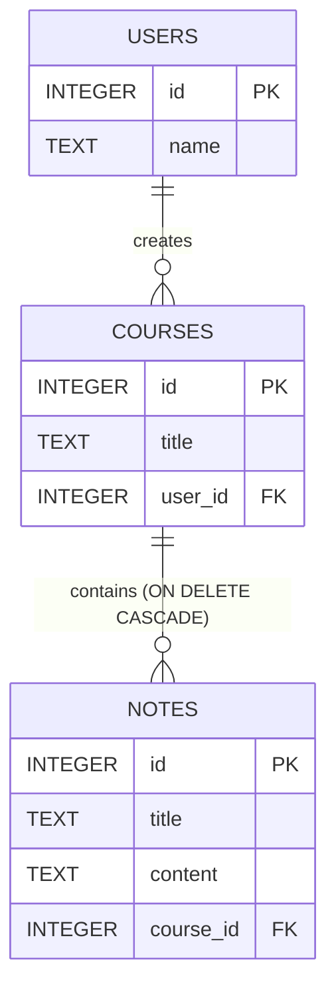

# StudyBuddy

StudyBuddy is a hierarchical personal learning tool designed to help students organize and summarize their study materials. It is built as a responsive, modern web application prioritizing UI/UX, robust database relationships, and AI-powered study assistance.

## Technology Stack

### Frontend
- **Framework**: React.js
- **Key Packages**:
  - `react-markdown`: For rendering rich text notes.
- **Design Philosophy**: Minimalist dashboard aesthetic utilizing inline CRUD editing, subtle box shadows, custom color-coding, and structured breadcrumb navigation.

### Backend
- **Runtime**: Node.js
- **Framework**: Express.js
- **Key Packages**:
  - `sqlite3`: In-memory and persistent relational database handling.
  - `dotenv`: Secure environment variable management.
  - `axios`: For external AI integration.
  - `cors`: For cross-origin resource sharing with the React frontend.

### Database
- **Engine**: SQLite3
- **Schema**:

## Logic & Architecture Decisions

1. **Relational Database Management (SQLite)**: We opted for SQLite to strictly demonstrate relational data handling. The schema establishes a parent-child relationship between `Courses` and `Notes`. The explicit `ON DELETE CASCADE` constraint guarantees that removing a course automatically purges all orphaned child notes without requiring iterative backend logic, ensuring data integrity.
2. **RESTful API Design**: We implemented standard REST conventions. The endpoints use nested routing (e.g., `POST /courses/:id/notes`) to reflect the parent-child hierarchy intuitively.
3. **AI Integration**: The `POST /notes/:id/summarize` endpoint securely retrieves the existing note content from the database and constructs a zero-shot prompt sent to the free Google Gemini 1.5 Flash API. This isolates the LLM dependency to a single service layer.
4. **React State & Inline CRUD**: Instead of jarring modals or multi-page reflows, we opted for inline editing states within `CourseList` and `NotesPanel`. This reduces cognitive load and maintains visual context within the dashboard.

## Installation & Setup

1. **Clone the repository**
2. **Backend Setup**:
   - `cd backend`
   - Create a `.env` file containing: `GEMINI_API_KEY=your_api_key_here`
   - `npm install`
   - `node server.js` (Runs on Port 5000)
3. **Frontend Setup**:
   - `cd frontend`
   - `npm install`
   - `npm start` (Runs on Port 3000)
